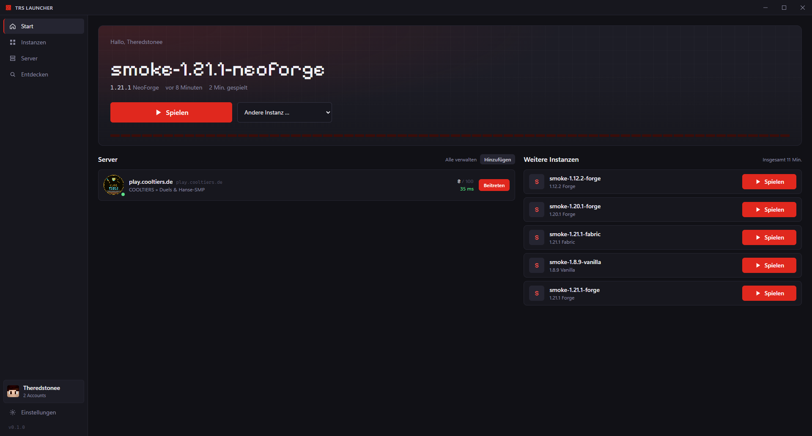

<div align="center">


# TRS Launcher

**A fast, modern Minecraft: Java Edition launcher for Windows, with a built-in client for FPS, HUD and PvP features.**

[](https://github.com/theredstonee/TRS-Launcher/releases)
[](https://github.com/theredstonee/TRS-Launcher/actions/workflows/release.yml)
[](https://github.com/theredstonee/TRS-Launcher/releases)
[](LICENSE)
<br />
[](#installation)
[](https://tauri.app)
[](https://www.rust-lang.org)
[](https://nuxt.com)
[](#features)

[Download](https://github.com/theredstonee/TRS-Launcher/releases) ·
[Wiki](https://github.com/theredstonee/TRS-Launcher/wiki) ·
[Features](#features) ·
[Building](#building-from-source) ·
[Architecture](#architecture)



</div>

> [!NOTE]
> TRS Launcher is in early development. Releases are published as pre-releases and update themselves automatically.

## Features

**Playing**
- Every Minecraft version from 1.5.2 to the latest 26.x, including snapshots
- **Fabric, Quilt, Forge and NeoForge** — Forge/NeoForge are installed with our own installer and processor runner
- Automatic Java: the right Mojang runtime is downloaded for each version
- **TRS Boost** — vanilla instances start with Fabric, the TRS Client and proven performance mods (Sodium, Lithium, FerriteCore, ImmediatelyFast, ModernFix, …). You can turn it off per instance for real vanilla
- Tuned JVM defaults (G1/ZGC by Java version) and the dedicated GPU on laptops
- Games keep running when you close the launcher and are picked up again on the next start

**TRS Client (in-game mod)**
- HUD with FPS, CPS, keystrokes and ping, fully draggable
- Zoom, fullbright and a custom in-game menu (Right Shift)
- Shipped with the launcher and installed automatically in every matching instance

**Content**
- Browse and install mods, modpacks, resource packs and shaders from **Modrinth**, dependencies included
- Pick any version, check for updates, enable or disable mods per instance
- Import instances from the **official launcher, Modrinth App, CurseForge, Prism Launcher, MultiMC** or any folder
- Export any instance as a **`.mrpack`** — mods that exist on Modrinth are linked, everything else is packed as overrides — and import pack files again

**Everything else**
- Multiple Microsoft accounts with one-click switching (tokens encrypted with Windows DPAPI)
- Server list with live player count and ping, one-click join
- **Skins & capes** with a 3D preview: keep your own skin library, switch model (classic/slim) and pick any cape you own
- **Screenshot gallery** across all instances with a fullscreen viewer, copy to clipboard and recycle bin
- **News** on the start page: Minecraft patch notes, Mojang news, trending Modrinth projects and launcher releases
- Live game log with filters, crash diagnosis, file repair and log sharing via mclo.gs (tokens redacted)
- Worlds, play time and instance duplication
- Signed automatic updates

## Installation

1. Download `TRS-Launcher_<version>_x64-setup.exe` from the [releases page](https://github.com/theredstonee/TRS-Launcher/releases).
2. Run it. It installs for your Windows user only and needs no administrator rights.
3. Sign in with the Microsoft account that owns Minecraft.

> [!TIP]
> The installer isn't code-signed yet, so Windows SmartScreen may show "Windows protected your PC". Choose **More info → Run anyway**.

Your data lives in `%APPDATA%\TRS-Launcher`.

## Fair play

- Sign-in works **only with a legitimately owned Microsoft account**, using Microsoft's official OAuth 2.0 flow (authorization code + PKCE, device code as fallback).
- There is **no offline or "cracked" mode**, and ownership checks are never bypassed.
- Game files are **not redistributed**. They are downloaded from Mojang's official servers directly to your PC.
- Your password never passes through the launcher. Tokens stay on your PC, encrypted, and are never sent to any third-party server.

## Building from source

**Requirements:** Node.js 22+ with pnpm, Rust (stable, MSVC toolchain), the Visual Studio Build Tools ("Desktop development with C++") and WebView2 (preinstalled on Windows 10/11).

```sh
pnpm install
pnpm app:dev      # Nuxt dev server + Tauri window with hot reload
```

| Command | Purpose |
|---|---|
| `pnpm app:build` | Release build and NSIS installer (`src-tauri/target/release/bundle`) |
| `pnpm typecheck` | Type-check TypeScript/Vue |
| `cargo test --workspace` (in `src-tauri`) | Rust tests |
| `cargo clippy --workspace --all-targets` (in `src-tauri`) | Rust lints |
| `./gradlew build` (in `client-mod/…`) | Build the TRS Client mod |

Set `TRS_LAUNCHER_HOME` to use a different data directory, which is handy for testing. The launch pipeline can also be tested without the UI:

```sh
cargo run -p trs-core --example launch -- <data-dir> 1.21.1 [vanilla|fabric|quilt|forge|neoforge] [seconds]
```

Development builds without a signed-in account start the game in its official **demo mode**. Release builds always require an account that owns the game.

### Releases

Pushing a tag like `v0.2.0` runs [`release.yml`](.github/workflows/release.yml). It builds and signs the installer, publishes a release and refreshes the update channel the built-in updater polls.

## Architecture

```
app/                    Nuxt 4 frontend (SPA, no SSR)
src-tauri/
  src/                  Tauri app: commands, error mapping, plugins
  crates/core/          trs-core: the UI-independent launcher core
    meta/ prepare.rs    Version metadata, libraries, natives, assets
    forge.rs loaders.rs Forge/NeoForge installer, Fabric/Quilt profiles
    launch.rs process.rs  Arguments, detached game processes, logs, crash diagnosis
    auth/               Microsoft → Xbox Live → Minecraft, encrypted account store
    modrinth.rs modpack.rs content.rs  Modrinth, modpacks, per-instance content
    modpack_export.rs   .mrpack export (Modrinth lookup by hash, overrides)
    skins.rs news.rs screenshots.rs    Minecraft profile/skins, news cache, screenshot gallery
    import.rs servers.rs boost.rs client_mod.rs
  resources/client-mod/ Bundled TRS Client builds + builds.json
client-mod/             TRS Client (Fabric multi-version, Forge 1.8.9)
```

Principles:

- **Logic lives in `trs-core`**, and the Tauri layer stays thin. The core validates every input itself.
- **The webview gets no file system, network or shell permissions.** Everything goes through dedicated commands, under a strict CSP.
- **Only a stable error kind and a readable message reach the UI.** Details go to the log.

## Code signing policy

Windows releases are signed so that Windows can verify who published them.

- Free code signing provided by [SignPath.io](https://about.signpath.io/), certificate by [SignPath Foundation](https://signpath.org/).
- Builds are made from this repository by [GitHub Actions](.github/workflows/release.yml). Every release needs manual approval before it is signed.

**Team roles**

| Role | Members |
|---|---|
| Committers and reviewers | [theredstonee](https://github.com/theredstonee) |
| Approvers | [theredstonee](https://github.com/theredstonee) |

**Privacy:** this program will not transfer any information to other networked systems unless specifically requested by the user or the person installing or operating it. See [PRIVACY.md](PRIVACY.md) for the services the launcher contacts and when.

## Acknowledgements

Parts of the process handling are adapted from [Polyfrost OneLauncher](https://github.com/Polyfrost/OneLauncher) (GPL-3.0-only). Game metadata comes from Mojang, and mod data comes from the [Modrinth API](https://docs.modrinth.com/).

## License

TRS Launcher is licensed under the [GNU General Public License v3.0](LICENSE).

<sub>TRS Launcher is not an official Minecraft product. It is not approved by or associated with Mojang or Microsoft.</sub>
